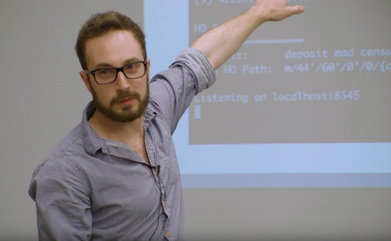
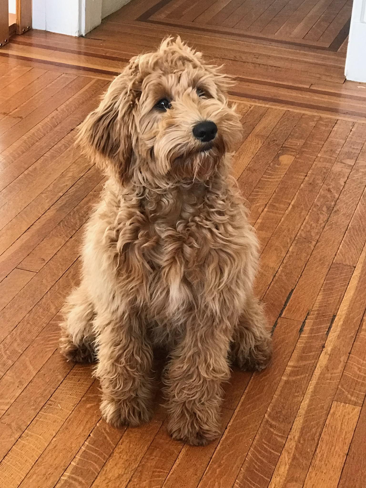

Hi, welcome to my website.

I've been programming professionally for about 6 years, coming from a nontraditional background (biology).  I started off using a LAMP stack to build a document management site for my PI while in grad school.  Shortly after, I used Bash and C++ to automate data collection and analysis for my research.  At the same time, I started a side job at the university's radio station as the maintainer of their website, a Ruby on Rails application.

A dropped out after 3 years of grad school to pursue web development professionally at a startup called Househappy (Backbone.js and Rails).  I also gained exposure to devops/infrastructure, QA, deployment, and the development process.

From there I joined SweetSpot, a diabetes healthcare company.  There I learned about CI/CD, microservices, and functional programming.

I took about six months off to travel, then joined PhishMe as a senior Rubyist working on an enterprise anti-phishing application.  During my time there, I led the development and deployment of our first microservice.

Currently, I'm an engineer at StitchFix working mostly on backend financial applications.

Outside of work, I enjoy rock climbing, tennis, disc golf, board games, and spending time with my wife and dog.

